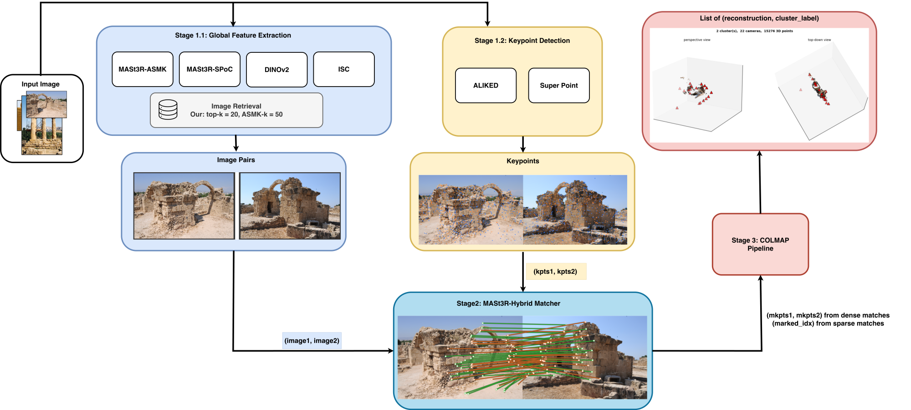
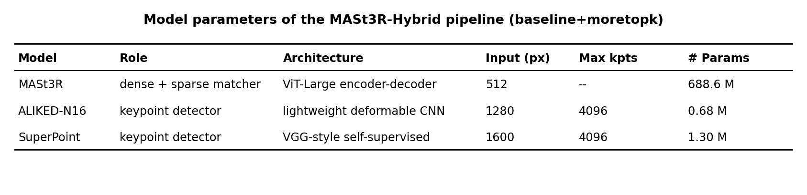
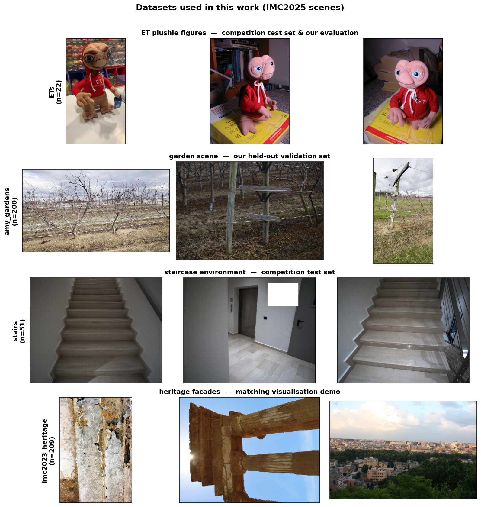
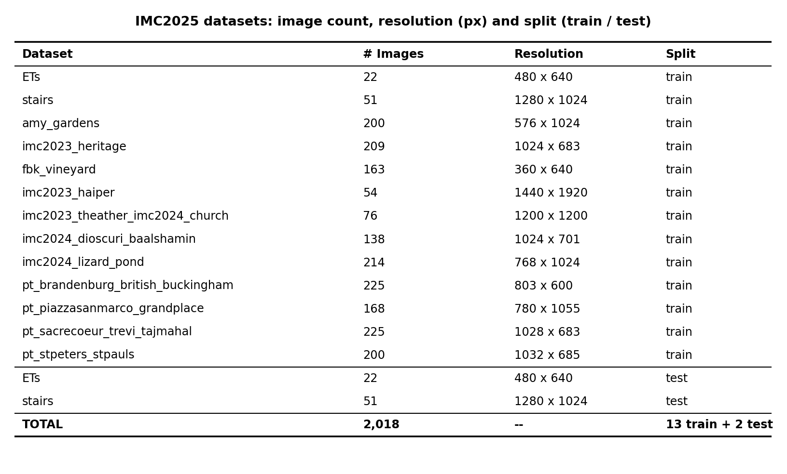
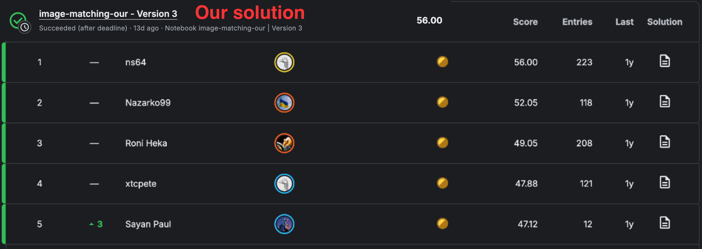
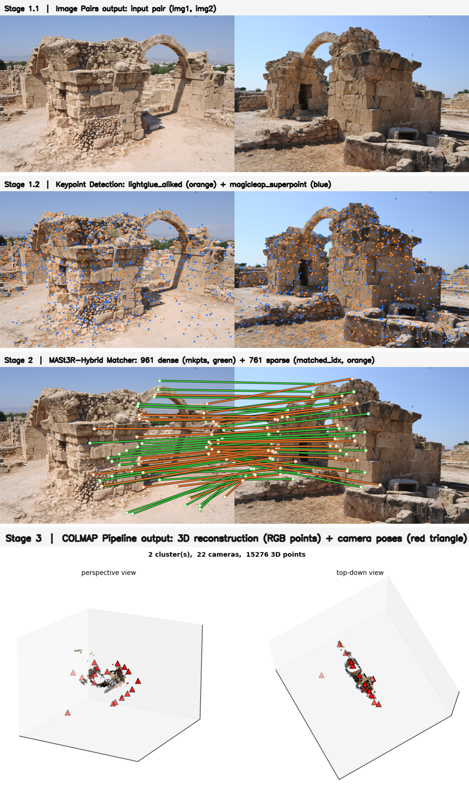
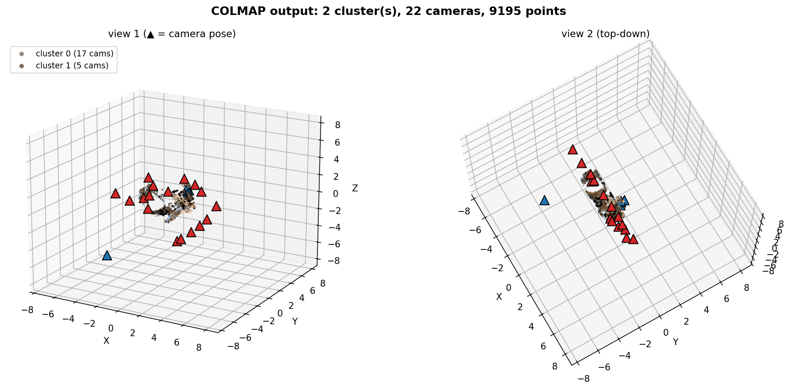
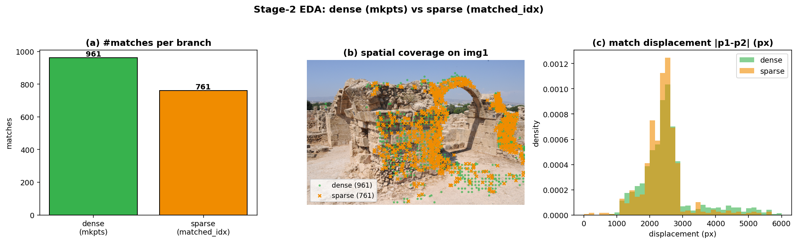

# NYCU CV2026 Final Project — Image Matching Challenge 2025

## **Course:** NYCU Selected Topics in Visual Recognition (CV2026) — Final Project
### ***Students:*** Pham Minh Long, Yeftha Joshua Ezekiel, Tran Khanh Nhan
### ***Student IDs:*** 314540080, 314540079, 414612013

---

## 1. Introduction

**Task.** The Image Matching Challenge 2025 (IMC2025) is end-to-end Structure-from-Motion: given a set of **unordered** images that may come from one or more scenes (plus outlier images), the system must (i) **cluster** each image into the scene it belongs to and (ii) recover a camera **pose** `(R, t)` for every registered image. The leaderboard metric is the **harmonic mean of clusterness and mean Average Accuracy (mAA)** — both must be high simultaneously. The hidden test set is two scenes: **ETs** (ET plushie figures) and **stairs** (repetitive staircases).

This repository replicates the **1st-place MASt3R-centric pipeline** and studies enhancements on top of it. Our best configuration, **`baseline+moretopk`**, enlarges the retrieval shortlist and is the only change that improves the validation score.

### Pipeline (4 stages)

| Stage | Block | Goal | Output |
|---|---|---|---|
| 1 | Global retrieval (ASMK · SPoC · DINOv2 · ISC) | shortlist likely-overlapping pairs | candidate pairs `P` |
| 2 | Keypoint detection (ALIKED-N16 · SuperPoint) | repeatable interest points | ≤4096+4096 keypoints / image |
| 3 | MASt3R-Hybrid matcher | high-precision matches | dense `mkpts` + sparse `matched_idx` |
| 4 | COLMAP | poses + scene clustering | `(reconstruction, cluster_label)` |



### Models

The three learned models behind the pipeline (parameter counts measured from the loaded checkpoints):



### Our contribution

We build a configuration-driven testbed of **seven enhancement families** (retrieval expansion, MAGSAC++ match pruning, grid filtering, detector-free matchers, explicit graph clustering, mapper tuning, multi-scale) and run a **greedy forward-selection study** on the `amy_gardens` validation scene. Only **shortlist expansion** beats the baseline:

| Knob added to baseline | top-`k` | ASMK `k` | amy_gardens score |
|---|:---:|:---:|:---:|
| `baseline` (022-a) | 10 | 35 | 44.73 |
| **`baseline+moretopk`** | **20** | **50** | **45.19** ✅ |

---

## 2. Environment Setup

Dependencies are declared in `pyproject.toml`. Example with **uv**:

```bash
uv python install 3.11
uv python pin 3.11

uv sync
. .venv/bin/activate
```

---

## 3. Usage

### 3.1 Data

**Sample images per scene:**



**Image count, resolution and split:**



### 3.2 Models

Set each model path in `conf/models.yaml` (`local` = your machine, `kernel` = Kaggle):

```yaml
MODEL_NAME:
  local: path/to/model/on/your/system
  kernel: path/to/model/on/kaggle/notebook
```

At least `MAGICLEAP_SUPERPOINT`, `DINOV2_BASE`, `ALIKED_LIGHTGLUE_N16`, `MAST3R`, `MAST3R_RETRIEVAL`, `MAST3R_RETRIEVAL_CODEBOOK`, `ISC` must be defined. Download weights from:

- SuperPoint — <https://github.com/magicleap/SuperGluePretrainedNetwork>
- ALIKED — <https://github.com/cvg/LightGlue>
- MASt3R — <https://github.com/naver/mast3r>
- ISC — <https://github.com/lyakaap/ISC21-Descriptor-Track-1st>

### 3.3 Evaluation

```bash
# All 2025 datasets
python evaluate_imc2025.py -c path/to/config.yaml -p imc2025

# A single scene (fast)
python evaluate_imc2025.py -c path/to/config.yaml --datasets ETs
```

Run our best configuration:

```bash
python evaluate_imc2025.py \
    -c conf/pipeline/imc2025/combination/baseline+moretopk.yaml \
    --datasets amy_gardens
# amy_gardens: score=45.19% (mAA=29.19%, clusterness=100.00%)
```

`run.sh` wraps the environment variables and lets you switch `CONFIG`/`DATASETS`.

### 3.4 Visualization

Three reusable scripts render the figures used in the report (`report/images/`):

```bash
# 1) MASt3R correspondences on an image pair 
python report/visualize_matching.py \
    --img1 data/train/imc2023_heritage/cyprus_dsc_6488.png \
    --img2 data/train/imc2023_heritage/cyprus_dsc_6512.png

# 2) COLMAP output: 3D point cloud + camera poses, coloured by cluster
python report/visualize_colmap.py --rec_dir /path/to/colmap_rec

# 3) Per-stage pipeline outputs (1.1 pair -> 1.2 keypoints -> 2 matcher -> 3 COLMAP)
#    + an EDA of the dense (mkpts) vs sparse (matched_idx) branches
python report/visualize_pipeline_outputs.py --rec_dir /path/to/colmap_rec
```

### 3.5 Submission

```bash
# Threads / offline / determinism
export OMP_NUM_THREADS=1 MKL_NUM_THREADS=1
export HF_HUB_OFFLINE=1 TRANSFORMERS_OFFLINE=1
export CUBLAS_WORKSPACE_CONFIG=':4096:8'
export DEFAULT_DATASET_DIR=data DEFAULT_MODEL_LIST_PATH=conf/models.yaml

# Multi-GPU Kaggle submission (2 GPUs)
torchrun --nnodes 1 --nproc_per_node 2 --standalone \
    -m ns64_imc2025lib.kernel -c config.yaml --env-name kernel --dist --kaggle-submit
```

> The Kaggle notebook installs a pre-built wheel (`ns64_imc2025lib`) from a Kaggle dataset rather than cloning this repo; `--nproc_per_node` must match the number of GPUs in the scoring environment.

---

## 4. Performance Snapshot

### Kaggle leaderboard

Our submission (`image-matching-our`, Version 3) scores **56.00** on the hidden test set, matching the 1st-place reference (`ns64`).



### Per-scene study (public ground truth)

| Configuration | ETs | amy_gardens |
|---|:---:|:---:|
| **`baseline+moretopk` (ours)** | 61.33 | **45.19** |
| `baseline` (022-a) | 61.33 | 44.73 |
| baseline + multi-scale | — | 44.11 |
| baseline + mapper-tuning | — | 43.03 |
| baseline + SALAD retriever | — | 40.32 |
| grid-filter | 57.53 | — |
| mpsfm-sparse | 53.52 | — |
| cascade (XFeat→MASt3R) | 37.96 | — |
| explicit clustering | 33.33 | 44.73 |
| GlueStick | 25.71 | — |

> **Findings.** `ETs` (22 images) is saturated — every reasonable method ties at 61.33. On the larger `amy_gardens`, only **retrieval expansion** improves the baseline (`+0.46`); detector-free matchers and explicit clustering both **hurt**, because COLMAP's implicit connected-component separation is already optimal.

### Pipeline outputs

Per-stage outputs on an `imc2023_heritage` pair — **(1.1)** input pair → **(1.2)** ALIKED + SuperPoint keypoints → **(2)** MASt3R-Hybrid dense `mkpts` + sparse `matched_idx` → **(3)** COLMAP 3D reconstruction:



**COLMAP output** — sparse 3D point cloud + recovered camera poses, coloured by cluster:



**Stage-2 EDA** — dense (`mkpts`) vs sparse (`matched_idx`) branches of the MASt3R-Hybrid matcher:



---

## 5. References

- **MASt3R** — Leroy et al., *Grounding Image Matching in 3D with MASt3R*, ECCV 2024. <https://arxiv.org/abs/2406.09756>
- **MASt3R-SfM** — Duisterhof et al., 2024. <https://arxiv.org/abs/2409.19152>
- **DUSt3R** — Wang et al., CVPR 2024. <https://arxiv.org/abs/2312.14132>
- **COLMAP** — Schönberger & Frahm, CVPR 2016.
- **ALIKED** — Zhao et al., IEEE TIM 2023. <https://arxiv.org/abs/2304.03608>
- **SuperPoint** — DeTone et al., CVPRW 2018.
- **LightGlue** — Lindenberger et al., ICCV 2023. <https://arxiv.org/abs/2306.13643>
- **DINOv2** — Oquab et al., TMLR 2024. <https://arxiv.org/abs/2304.07193>
- **ISC** — Pizzi et al., CVPR 2022.
