# HW1 — Image Classification

#### ***Course:*** Selected Topics in Pattern Recognition using Deep Learning (NYCU)

#### ***Student:*** Pham Minh Long

#### ***Student ID:*** 314540080

---

## Introduction

This project addresses a **100-class image classification** task on an ImageNet-derived dataset as part of the NYCU *Selected Topics in Pattern Recognition using Deep Learning* course. The training set contains 20,724 images across 100 categories with a class-imbalanced distribution; the validation set has 300 images.

**Constraints:** Only **ResNet-family backbones** (ResNet, ResNetRS, SEResNeXt variants) are used, all sourced from the [timm](https://huggingface.co/timm) model hub, with a hard limit of **≤ 100M parameters**.

### Training Techniques

| Technique | Details |
|---|---|
| Optimizer | AdamW with weight decay `5e-4` |
| LR Scheduler | Cosine annealing with linear warmup (3 epochs) |
| Mixup | `alpha = 0.1` for soft label mixing |
| Label Smoothing | `ε = 0.05` |
| Gradient Clipping | Max norm `1.0` |
| Gradient Accumulation | 4 steps |
| Dropout | 0.2–0.3 depending on backbone |
| Class Imbalance | Weighted random sampler + class-weighted loss |
| LoRA Fine-tuning | Optional: rank 16, alpha 32 on linear layers |
| Multi-GPU | PyTorch DDP via `torchrun` |

### Data Augmentation

The offline augmentation pipeline (`src/data/augment_data.py`) uses **Albumentations** to generate a stronger training set (`data/train_strong/`):

- Geometric: `HorizontalFlip`, `VerticalFlip`, `RandomRotate90`, `ShiftScaleRotate`
- Color: `RandomBrightnessContrast`, `HueSaturationValue`, `CLAHE`, `RGBShift`
- Noise/Blur: `GaussianBlur`, `MotionBlur`, `GaussNoise`, `MedianBlur`
- Distortion: `GridDistortion`, `ElasticTransform`, `OpticalDistortion`
- Occlusion: `CoarseDropout` (cutout)
- Weather simulation: `RandomShadow`, `RandomFog`

### Code Architecture

The codebase follows **SOLID principles** and applies several **design patterns**:

- **Factory Pattern** — `src/models/model_factory.py` centralises model construction
- **Strategy Pattern** — `AugmentationStrategy` (Albumentations vs Torchvision) in `src/data/augment_data.py`
- **Interface Segregation** — abstract base classes in `src/models/interface/` and `src/models/neural_network.py`
- **Dependency Inversion** — services (`src/services/`) depend on interfaces, not concrete models
- **Configuration-driven** — all hyperparameters externalized to YAML files in `configs/`

---

## Environment Setup

### Option 1 — Conda (recommended)

```bash
conda env create -f environment.yml
conda activate selected-topics
```

### Option 2 — uv

```bash
uv venv .venv --python 3.11
source .venv/bin/activate
uv pip install -r requirements.txt
```

### Option 3 — pip

```bash
pip install -r requirements.txt
```

> Requires: Python 3.11, PyTorch ≥ 2.0, torchvision ≥ 0.15, timm ≥ 0.9, albumentations ≥ 2.0.

### Option 4 — Docker

Build and run the container:

```bash
# Build the image
docker build -t hw1-image-clf .

# Run with GPU support (mount your data directory)
docker run --gpus all \
  -v $(pwd)/data:/workspace/data \
  -v $(pwd)/checkpoints:/workspace/checkpoints \
  -v $(pwd)/logs:/workspace/logs \
  -it hw1-image-clf bash

# Inside the container, train or test as normal:
bash src/scripts/train.sh
bash src/scripts/test.sh
```

---

## Usage

### Project Layout

```
hw1/
├── configs/
│   ├── test.yaml                  # Inference config
│   └── train/                     # One YAML per model experiment
├── src/
│   ├── data/
│   │   ├── augment_data.py        # Offline data augmentation
│   │   ├── data_cleaner.py        # Data quality analysis & cleaning
│   │   ├── dataset.py             # PyTorch Dataset + transforms
│   │   └── dataclass.py           # Config dataclasses
│   ├── models/                    # Model factory, LoRA, ResNet wrappers
│   ├── scripts/
│   │   ├── train.sh
│   │   └── test.sh
│   └── services/                  # Trainer and Tester services
├── notebooks/
│   └── data_quality_analysis.ipynb
├── logs/                          # Training logs (TensorBoard)
├── charts/                        # Training curves, ROC, confusion matrices
├── runs/                          # Performance CSVs per model
├── train.py
└── test.py
```

---

### Configuration

All hyperparameters live in YAML files. Each training config under `configs/train/` follows this schema:

```yaml
model:
  backbone: timm/<model_name>   # timm model identifier
  pretrained: true
  num_classes: 100
  drop_rate: 0.2
  checkpoint: null              # optional: resume from checkpoint

data:
  train_dir: data/train_strong  # use augmented set or data/train
  val_dir: data/val
  image_size: 320               # final crop size
  resize_size: 360              # resize before crop
  batch_size: 64
  num_workers: 4
  use_augmentation: true        # online augmentation during training

training:
  epochs: 20
  lr: 1.0e-4
  min_lr: 1.0e-6
  weight_decay: 5.0e-4
  optimizer: adamw
  scheduler: cosine             # cosine | step | plateau
  warmup_epochs: 3
  label_smoothing: 0.05
  gradient_clip: 1.0
  mixup_alpha: 0.1
  accumulation_steps: 4

output:
  checkpoint_dir: checkpoints/<run_name>
  log_dir: logs/<run_name>
  save_top_k: 10               # keep top-k checkpoints by val acc
```

The inference config (`configs/test.yaml`) only requires `model`, `data.test_dir`, and `output.submission_file`.

---

### Training

```bash
# Default config (seresnextaa101d_32x8d best model, GPU 0)
bash src/scripts/train.sh

# Override config file
CONFIG=configs/train/resnet50d.a1_in1k_imbalance.yaml bash src/scripts/train.sh

# Multi-GPU (e.g. 4 GPUs)
NPROC=4 DEVICES=0,1,2,3 bash src/scripts/train.sh

# Select a specific GPU
DEVICES=2 bash src/scripts/train.sh

# Run directly
python train.py --config configs/train/resnet50d.a1_in1k_imbalance.yaml --seed 42
```

**Script variables** (`src/scripts/train.sh`):

| Variable | Default | Description |
|---|---|---|
| `CONFIG` | `configs/train/seresnextaa101d_32x8d.sw_in12k_ft_in1k_288_imbalance.yaml` | Config file path |
| `SEED` | `42` | Random seed |
| `NPROC` | `1` | Number of GPUs (> 1 → DDP via `torchrun`) |
| `DEVICES` | `0` | `CUDA_VISIBLE_DEVICES` |

Checkpoints are saved to `checkpoints/<run_name>/` and training logs to `logs/<run_name>/`.

```bash
# Monitor training with TensorBoard
tensorboard --logdir logs/
```

---

### Inference / Test

```bash
# Default config (configs/test.yaml)
bash src/scripts/test.sh

# Override config
CONFIG=configs/test.yaml DEVICES=1 bash src/scripts/test.sh

# Run directly
python test.py --config configs/test.yaml --seed 42
```

**Script variables** (`src/scripts/test.sh`):

| Variable | Default | Description |
|---|---|---|
| `CONFIG` | `configs/test.yaml` | Config file path |
| `SEED` | `42` | Random seed |
| `DEVICES` | `6` | `CUDA_VISIBLE_DEVICES` |

The prediction output is saved to the path specified in `output.submission_file` (default: `runs/<model>/prediction.csv`).

---

### Data Analysis, Cleaning & Augmentation

#### EDA and Data Quality (Notebook)

Open the notebook to run full data quality analysis:

```bash
jupyter notebook notebooks/data_quality_analysis.ipynb
```

The notebook covers:
1. **CleanVision** — detects blurry, dark, light, oddly-sized, and near-duplicate images
2. **Cleanlab** — identifies label noise and assigns quality scores per sample
3. **OOD detection** — flags out-of-distribution outliers using cosine similarity on embeddings
4. **t-SNE** — visualises class cluster separation
5. **Class distribution** — identifies imbalanced classes
6. **Confusion matrix** — per-class accuracy on the validation set

Selected outputs from the notebook:

| Class Distribution | Image Size Distribution |
|:---:|:---:|
| 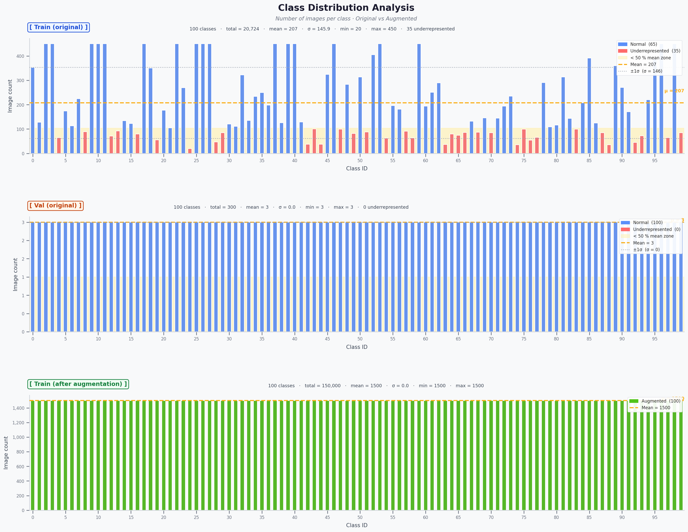 | 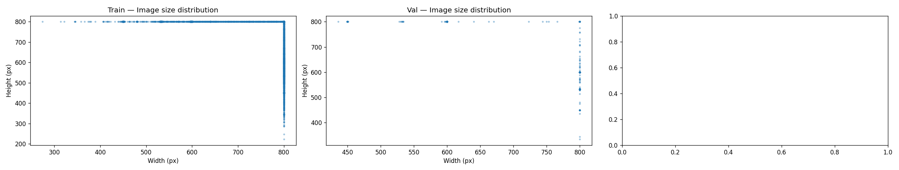 |

| Label Issues per Class | Label Quality Scores |
|:---:|:---:|
| 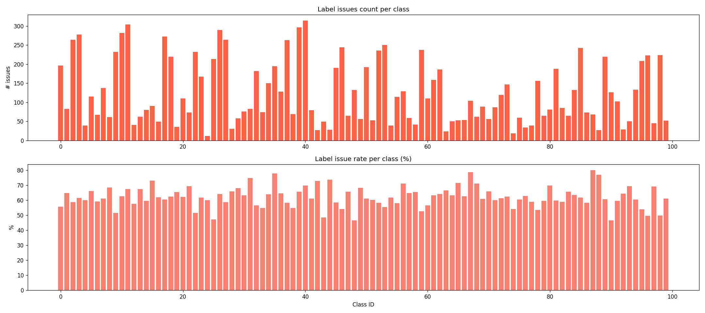 | 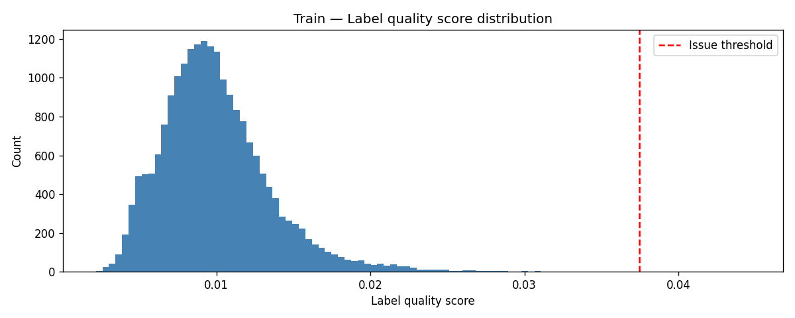 |

| Near-Duplicate Samples | Outlier Samples |
|:---:|:---:|
| 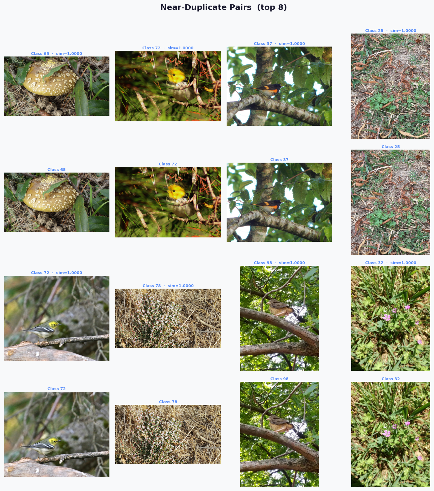 | 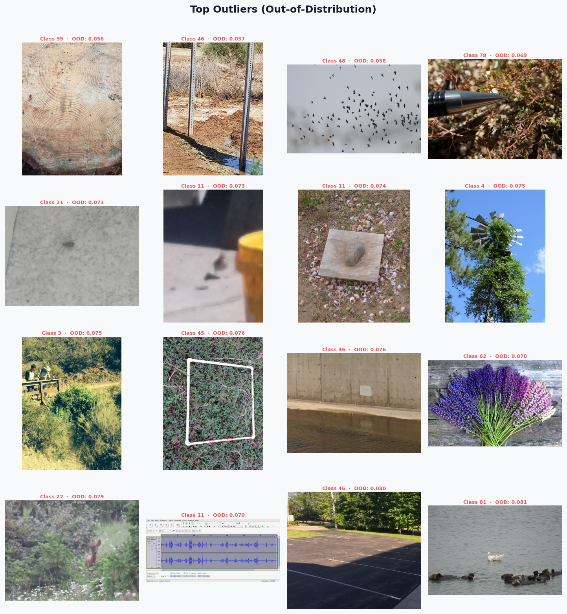 |

| Worst Label Quality Samples | Worst Label Quality Distribution |
|:---:|:---:|
| 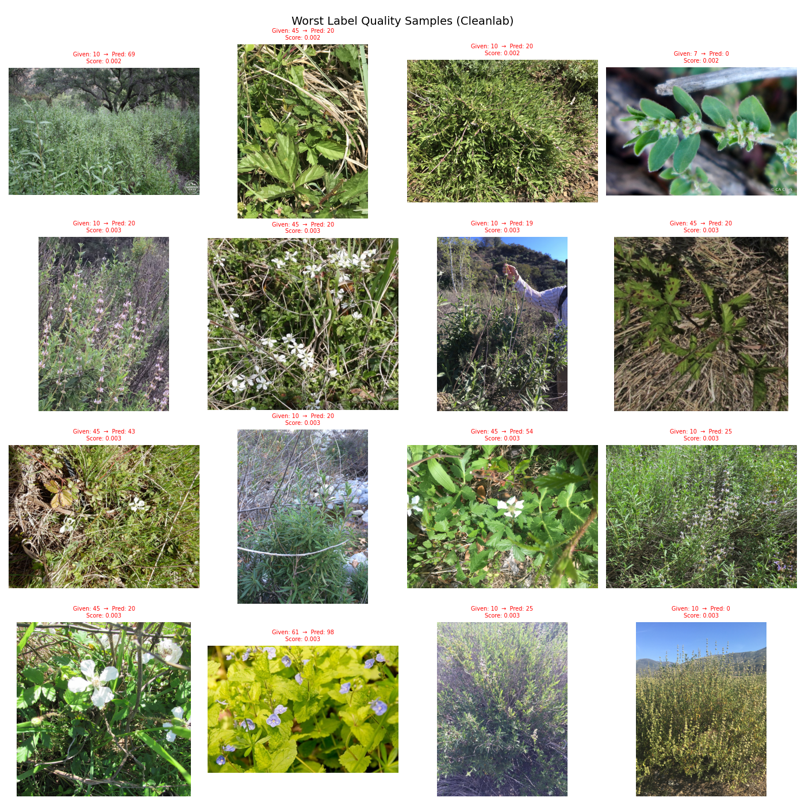 |  |

#### Data Cleaning

Run the standalone cleaner to generate quality reports in `data/train_reports/`:

```bash
python -m src.data.data_cleaner --data_dir data/train --output_dir data/train_reports
```

Output files:

| File | Contents |
|---|---|
| `cleaning_report.csv` | Consolidated per-image quality flags |
| `cleanvision_issues.csv` | 18 visual quality metrics |
| `integrity.csv` | Corruption and minimum size checks |
| `label_noise.csv` | Mislabelled samples with quality scores |
| `near_duplicates.csv` | Near-duplicate pairs with cosine similarity |
| `outliers.csv` | OOD samples with outlier scores |

#### Offline Data Augmentation

Generate the stronger training set used by the best models:

```bash
python -m src.data.augment_data \
    --input_dir data/train \
    --output_dir data/train_strong \
    --strategy albumentations \
    --multiplier 2
```

---

## Performance Snapshot

All models were fine-tuned from ImageNet pretrained weights for **20 epochs** on the 100-class imbalanced training set using AdamW + cosine LR. Results are taken from the last run's `performance.csv` in `runs/`.

| Model | Parameters | Epochs | LR | Img Size | Train Loss | Val Loss | Train Acc | Val Acc |
|:---|---:|:---:|:---:|:---:|:---:|:---:|:---:|:---:|
| [resnet50d.a1_in1k](https://huggingface.co/timm/resnet50d.a1_in1k) | 23.7M | 20 | 1e-4 | 288 | 1.5518 | 0.8492 | 72.82% | 89.67% |
| [resnet152d.ra2_in1k](https://huggingface.co/timm/resnet152d.ra2_in1k) | 58.4M | 14 | 1e-4 | 320 | 1.3851 | 0.7508 | 76.52% | 91.00% |
| [resnetrs200.tf_in1k](https://huggingface.co/timm/resnetrs200.tf_in1k) | 91.4M | 20 | 1e-4 | 320 | 1.3250 | 0.6990 | 77.10% | 91.67% |
| [seresnext101_32x8d.ah_in1k](https://huggingface.co/timm/seresnext101_32x8d.ah_in1k) | 91.7M | 20 | 1e-4 | 320 | 1.2091 | 0.6674 | 80.26% | 93.67% |
| [seresnext101d_32x8d.ah_in1k](https://huggingface.co/timm/seresnext101d_32x8d.ah_in1k) | 91.7M | 20 | 1e-4 | 288 | 1.1853 | 0.6672 | 80.92% | 92.67% |
| [seresnextaa101d_32x8d.ah_in1k](https://huggingface.co/timm/seresnextaa101d_32x8d.ah_in1k) | 91.7M | 20 | 1e-4 | 288 | 1.0900 | 0.6893 | 83.19% | 92.33% |
| [seresnextaa101d_32x8d.sw_in12k_ft_in1k](https://huggingface.co/timm/seresnextaa101d_32x8d.sw_in12k_ft_in1k) | 91.7M | 20 | 1e-4 | 288 | 1.1939 | 0.5729 | 80.56% | 95.00% |
| **[seresnextaa101d_32x8d.sw_in12k_ft_in1k_288](https://huggingface.co/timm/seresnextaa101d_32x8d.sw_in12k_ft_in1k_288) ✅** | **91.7M** | **20** | **1e-9** | **320** | **1.2735** | **0.5932** | **89.00%** | **97.00%** |

**Best model:** `seresnextaa101d_32x8d.sw_in12k_ft_in1k_288` achieves a validation accuracy of **97.00%**, surpassing all other evaluated backbones by at least 2 percentage points. This model benefits from pre-training on ImageNet-12k followed by fine-tuning on ImageNet-1k at 288px resolution, giving it significantly richer feature representations.

---

## GradCAM Visualization

Gradient-weighted Class Activation Maps (Grad-CAM) highlight the regions of an input image that the model focuses on when making a prediction. The visualizations below are generated from the best model (`seresnextaa101d_32x8d.sw_in12k_ft_in1k_288`) using the notebook `notebooks/data_quality_analysis.ipynb`.

### Single Image

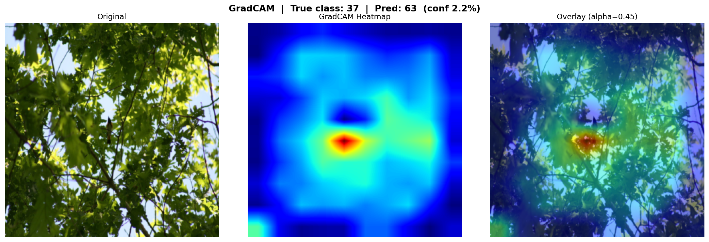

### Multi-Class Activation

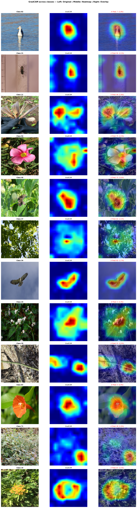

### Target Class Comparison

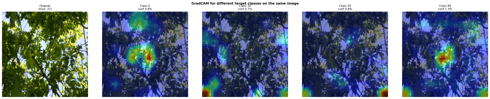

### Layer Comparison

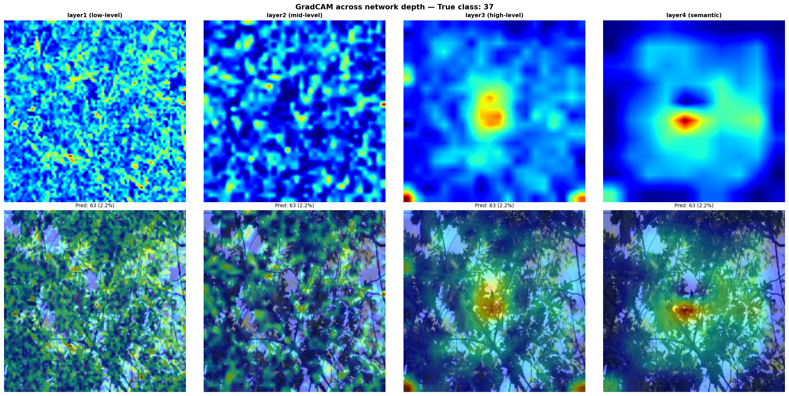

---

## References

1. **timm — PyTorch Image Models**: 
* https://huggingface.co/timm
* https://github.com/huggingface/pytorch-image-models
2. **ImageNet Large Scale Visual Recognition Challenge**: https://www.image-net.org/
3. **He et al., Deep Residual Learning for Image Recognition (ResNet)**: https://arxiv.org/abs/1409.0575
4. **Krizhevsky et al., ImageNet Classification with Deep CNNs (AlexNet)**: https://proceedings.neurips.cc/paper_files/paper/2012/file/c399862d3b9d6b76c8436e924a68c45b-Paper.pdf
5. **Woo et al., ConvNeXt V2 / modern training recipes**: https://arxiv.org/abs/2208.11695