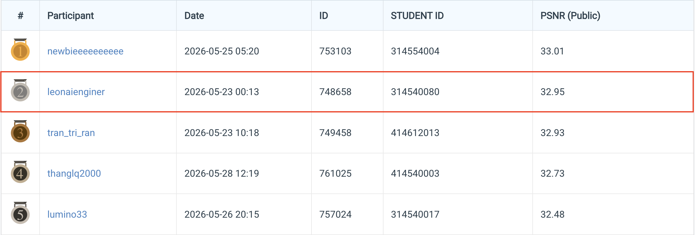
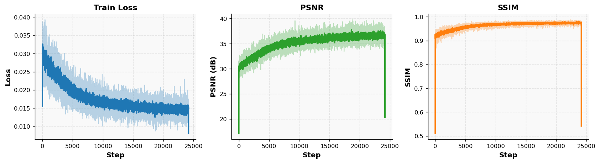
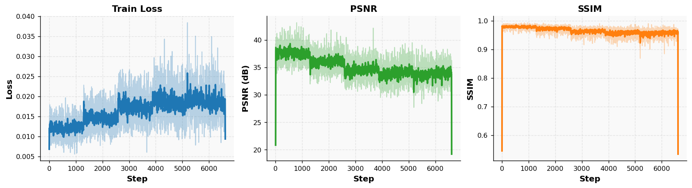
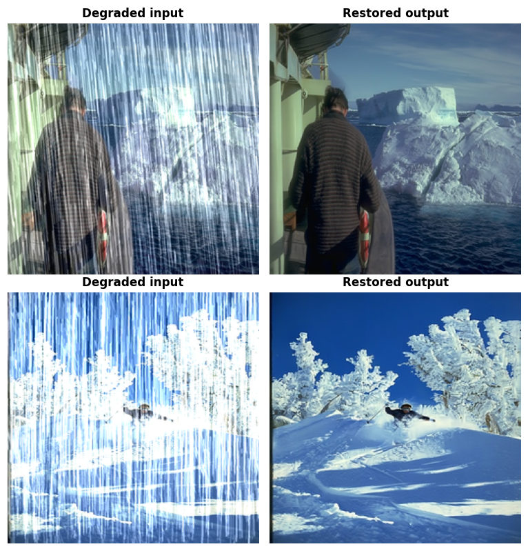

# NYCU CV2026 HW4 — Image Restoration

## **Course:** NYCU Selected Topics in Visual Recognition (CV2026) — Homework 4
### ***Student:*** Pham Minh Long
### ***Student ID***: 314540080

---

## 1. Introduction

**Task:** All-in-one blind image restoration. Given degraded RGB images affected by rain streaks or snow, predict the clean RGB image and submit the restored stack as a `.npz` archive. The metric on the public leaderboard is **PSNR / SSIM** averaged over the test split.

This repository implements **PromptIR** (NeurIPS 2023) — a transformer-based all-in-one restoration network — and trains it from scratch on the released rain + snow set. A single backbone is benchmarked under two recipes selectable via YAML:

| Version | Pixel loss | Edge loss | FFT-L1 loss | EMA | Mixed precision |
|---|:---:|:---:|:---:|:---:|:---:|
| `v1` | L1 | 0.1× | — | ✗ | `16-mixed` |
| `v2` | Charbonnier | 0.05× | 0.1× | ✓ (decay=0.999) | `bf16-mixed` |

### Data Processing & Augmentation

* Train splits: 1600 rain + 1600 snow images at native resolution; each lives under `data/hw4_realse_dataset/train/degraded/` with a parallel `train/clean/` GT folder. The filename rule maps `rain-K.png` ↔ `rain_clean-K.png` (and similarly for snow).
* The dataset is virtually inflated by `num_aug=120` (each entry returns a fresh random 128×128 crop + a random dihedral transform per epoch).
* On the test side, every degraded image is loaded at its native resolution and cropped to a multiple of 16 before being fed to the network.

### Model & Backbone

A single ~36 M-parameter PromptIR with prompt blocks at three decoder scales. Encoder/decoder share a 4-level transformer pyramid (`dim=48`, `num_blocks=[4, 6, 6, 8]`, `heads=[1, 2, 4, 8]`).

### Loss Functions & Optimisation

* **Pixel** — L1 (`v1`) or Charbonnier (`v2`, smooth L1 with `eps=1e-3`).
* **Edge** — L1 on Sobel-magnitudes of the luma channel.
* **FFT (v2)** — L1 between `|rFFT2(pred)|` and `|rFFT2(gt)|`.
* **Optimizer** — AdamW (`lr=2e-4`, `betas=(0.9, 0.999)`, `wd=1e-4`).
* **Schedule** — Linear warmup (15 epochs) → cosine annealing to `eta_min=1e-6` over `max_epochs=150`.
* **Mixed precision** — `16-mixed` for `v1`, `bf16-mixed` for `v2`. Gradient clipping `0.5` for `v2`.

### Inference

`test.py` supports two model-loading modes (`inference.use_ema: true|false`) and three TTA options:

| Knob | Effect |
|---|---|
| `self_ensemble: true` | Average over 8 dihedral transforms of the input |
| `tile: true` | Reflection-pad and run patch-by-patch with overlapping blending |
| `use_ema: true` | Load `ema_state_dict` from the checkpoint instead of live weights |

Output is a single `pred.npz` where each key is the original filename and each value is a `(3, H, W)` `uint8` tensor in `[0, 255]`.

---

## 2. Environment Setup

### Option A — Conda

```bash
conda create -n hw4 python=3.10 -y
conda activate hw4

pip install torch==2.4.1 torchvision==0.19.1 --index-url https://download.pytorch.org/whl/cu121

pip install -r requirements.txt
```

### Option B — pip / uv

```bash
pip install -r requirements.txt
```

---

## 3. Usage

### 3.1 Data Preparation

Generate the rain/snow file lists used by `PromptTrainDataset`:

```bash
bash src/scripts/preprocessing.sh --data-dir data/hw4_realse_dataset
```

This writes `data/rain.txt` and `data/snow.txt` (already shipped in this repo).

### 3.2 Training

```bash
bash src/scripts/train.sh --config configs/train/promptir/v1.yaml

bash src/scripts/train.sh --config configs/train/promptir/v2.yaml

bash src/scripts/train.sh \
    --config configs/train/promptir/v2.yaml \
    --resume checkpoints/promptir/promptir_base/v2/last.ckpt

bash src/scripts/train.sh \
    --config configs/train/promptir/v2.yaml \
    --init-from checkpoints/promptir/promptir_base/v1/best_rainsnow_edge.ckpt
```

Config path convention: `configs/train/<model>/<version>.yaml`.
Outputs land under `checkpoints/<model>/<backbone>/<version>/{best,last}.ckpt`, with logs in `logs/<model>/<backbone>/<run_id>.log`.

### 3.3 Inference / Test

```bash
bash src/scripts/test.sh --config configs/test/promptir/v2.yaml --gpu-ids 0

python test.py \
    --config     configs/test/promptir/v2.yaml \
    --checkpoint checkpoints/promptir/promptir_base/v2/best_rainsnow_edge_v2.ckpt \
    --gpu-ids    0 \
    --self-ensemble \
    --use-ema
```

Submission output: `submissions/<model>/<backbone>/<version>/pred.npz`.

### 3.4 Visualisation

To dump every scalar logged to W&B (offline runs) as PNG figures:

```bash
bash src/scripts/plot_wandb.sh wandb charts/wandb_plots
```

---

## 4. Performance Snapshot

### Leaderboard



| Recipe | **Leaderboard PSNR** | Train-patch PSNR / SSIM |
|---|:---:|:---:|
| **`v1` — Edge** (L1 + edge) | **32.95 dB** | 36.67 / 0.9747 |
| `v2` — Edge+FFT (Charbonnier) | 32.93 dB | 37.54 / 0.9784 |

> Best single-model submission: **PromptIR `v1`** with L1 + edge loss and 8-way self-ensemble → **32.95 dB**. `v2` (Charbonnier + edge + FFT) leads on the training-patch metric but only matches `v1` on the test set; evaluate `v2` with `--no-use-ema` (live weights), since EMA weights are detrimental here.

### Training Curves

Train loss, PSNR, and SSIM over training steps (light: raw; solid: smoothed).

**`v1` — Edge:**



**`v2` — Edge+FFT:**



### Restoration Results

Two test images (top: rain, bottom: snow). Left: degraded input — Right: restored output.



---

## 5. References

- **PromptIR** — Potlapalli et al., *Prompting for All-in-One Blind Image Restoration*, NeurIPS 2023. <https://arxiv.org/abs/2306.13090>
- **Restormer (transformer block design)** — Zamir et al., CVPR 2022. <https://arxiv.org/abs/2111.09881>
- **Charbonnier loss** — Lai et al., CVPR 2017. <https://arxiv.org/abs/1704.03915>
- **PyTorch Lightning** — <https://lightning.ai/docs/pytorch/stable/>
